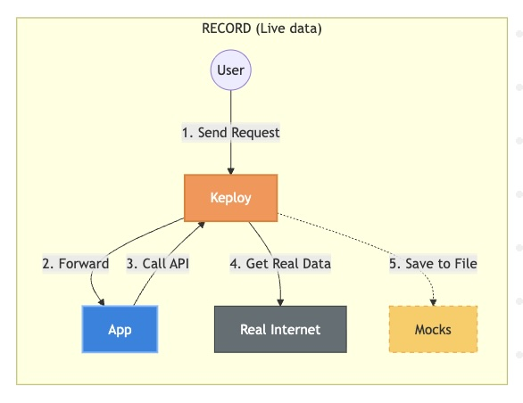
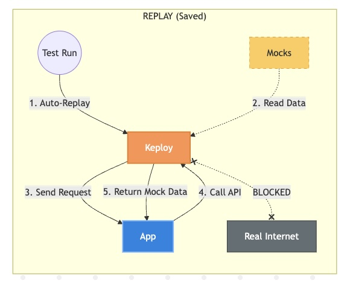
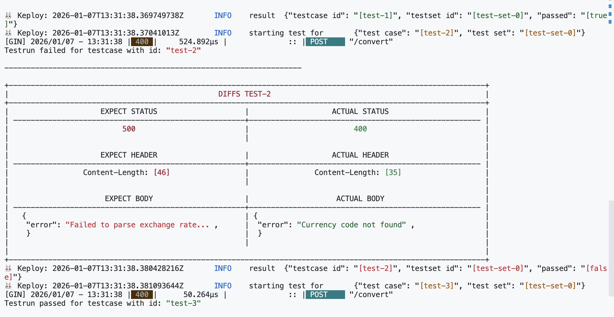

We know that modern applications rely heavily on external APIs. But have you ever wonder what happens when those APIs change, rate-limit you, or simply go down? And how do you ensure your application logic remains solid despite these external fluctuations? In this blog, let’s explore how to integrate Keploy into a Go application to solve these challenges.

## What is Keploy?


[Keploy](https://github.com/keploy) is an open-source test generation tool that:



- **Records** real API calls along with external dependency interactions like HTTP calls to third-party APIs.

- **Generates** test cases and data mocks from that traffic.


- **Replays** them as deterministic tests, "freezing time" for your application.

The best thing is, You don’t need to write complex mock servers or change your application code as Keploy hooks into network traffic via eBPF ([eBPF](https://youtu.be/B5aM3WP1hNw?si=OsIc6GwzgYUjMa4q) is an another awesome topic) and captures it seamlessly.

So the basic idea is very simple:


1. Run the app with Keploy in Record Mode.

2. Make API calls (interact with the app).

3. Replay the captured scenarios to verify behavior.

Let’s get hands-on. I’ll be using a Go Currency Converter built with the Gin framework. This app fetches live exchange rates from the public Frankfurter API.


You can view the source code of the application here: [Github Link](https://github.com/cnu1812/currency-converter)

[Project set-up Locally](readme.md) Here you can find all the info about how to set-up keploy CLI, Prerequisites and so on..

### Record test cases using the Keploy CLI?

If incase keploy-cli is not installed. Use the following command to install the Keploy CLI:
```
curl --silent --location "https://keploy.io/install.sh" | bash
```

Now, let’s capture the test cases:

```
sudo -E keploy record -c "go run main.go"
```

Let this be running in the terminal, To run test cases open a new terminal.

1. [The Happy Path (USD to EUR):](./keploy/test-set-0/tests/test-4.yaml)

```
curl -X POST http://localhost:8080/convert \
-H "Content-Type: application/json" \
-d '{"from": "USD", "to": "EUR", "amount": 100}'
```

Output

```
{"converted_amount":85.419,"exchange_rate":0.85419,"message":"Calculated using live rates!","original_amount":100,"original_currency":"USD"}
```

2. [The Edge Case (Zero Amount):](./keploy/test-set-0/tests/test-2.yaml)

```
curl -X POST http://localhost:8080/convert \
-H "Content-Type: application/json" \
-d '{"from": "USD", "to": "EUR", "amount": 0}'
```

We can see that Keploy has successfully captured the test cases. It intercepted the request to Go app and the outgoing request to the Frankfurter API, saving the response as a [Mock.](./keploy/test-set-0/mocks.yaml)

### How to Replay and Verify

Now that we have recorded the traffic, let's shut down the internet. We can run the tests, and Keploy will serve the recorded Frankfurter API responses instead of calling the real API.

Run the test mode:

```
sudo -E keploy test -c "go run main.go" --delay 10
```

The Output: You might see something like this:

```
Total tests: 2
Passed: 1
Failed: 1
```

**Wait, why did a test fail?** Don't panic let me explain

- **The Reason:** During the recording phase, the external API i.e Frankfurter had a momentary network blip, causing my app to return a `500 Internal Server Error`. Keploy recorded this `500` as the "expected truth."

- **The Replay:** During the test phase, the app using the mock behaved slightly differently or the error message format didn't match perfectly, causing a mismatch.

This highlights the power of Keploy: it is strict. It ensures your application behaves exactly as it did during recording. For example, If you fix a bug changing a 500 error to a graceful 200 OK, Keploy will alert you that the behavior has changed.

## A Failed Test Case (A very good learning experience)

During my recording session, I ran into an interesting scenario that taught me a lot about testing reliability.

I sent a request with `amount:` 0. At that exact moment, my internet flickered, and my app crashed with a `500 Internal Server Error`.

**Keploy recorded this crash.** It assumed, *"Okay, when the amount is 0, the correct behavior is to crash."*

When I ran the tests later using:

```
sudo -E keploy test -c "go run main.go" --delay 10
```

**The Result:**
```
Total tests: 2
Passed: 1
Failed: 1  ## test-2 failed!
```
During the test replay, my app didn't crash exactly the same way or maybe it didn't crash at all!, so the response didn't match the recorded 500 error.

**The Lesson:** This was actually a good thing. It showed me that Keploy is super strict. It ensures that my app behaves exactly as it did when I recorded it. If I fix a bug, Keploy will flag it as a change, forcing me to update my test baseline.

> Keploy is super strict!

## Conclusion

We explored how to integrate Keploy with a Go application dependent on an external API. We learned how to record traffic, the importance of dynamic runtime policies in eBPF, and how to analyze test failures.

Adding this layer of "Record & Replay" testing ensures that the application logic is verified against real-world data without the flakiness of real-world network issues.